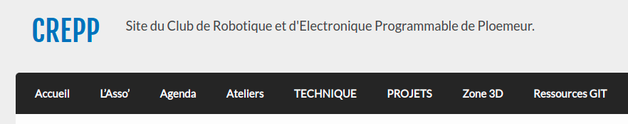
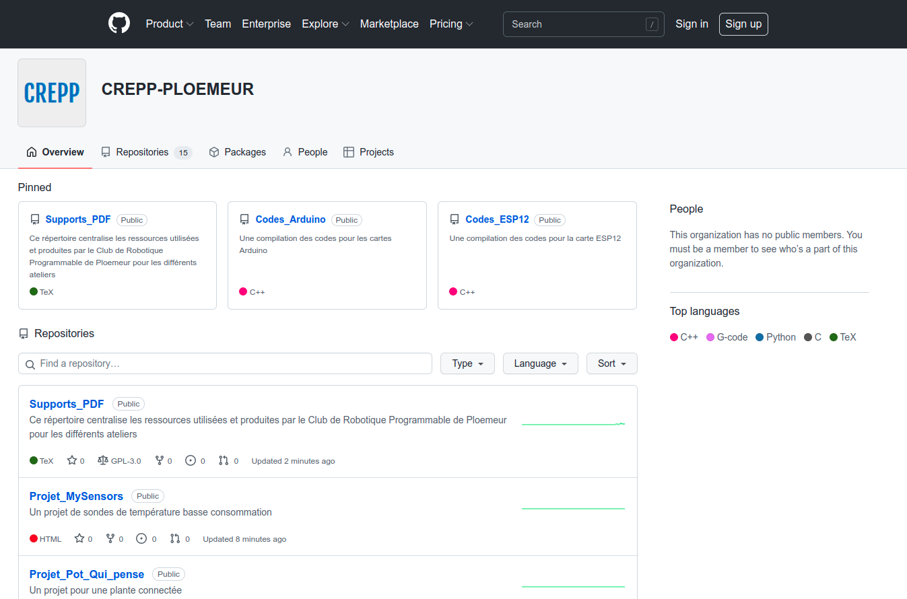
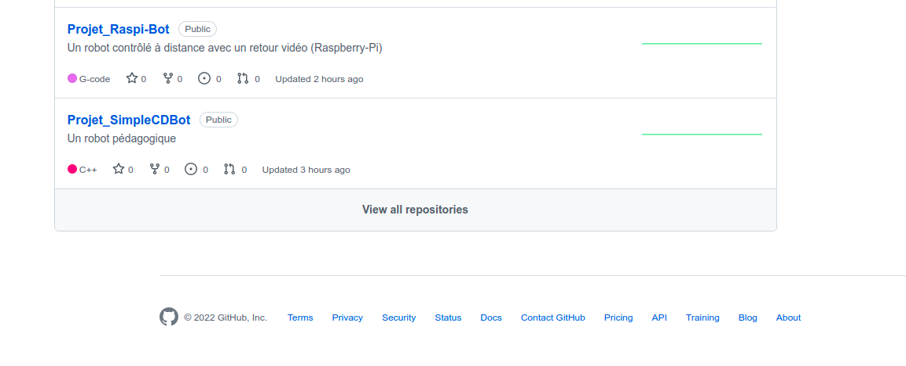
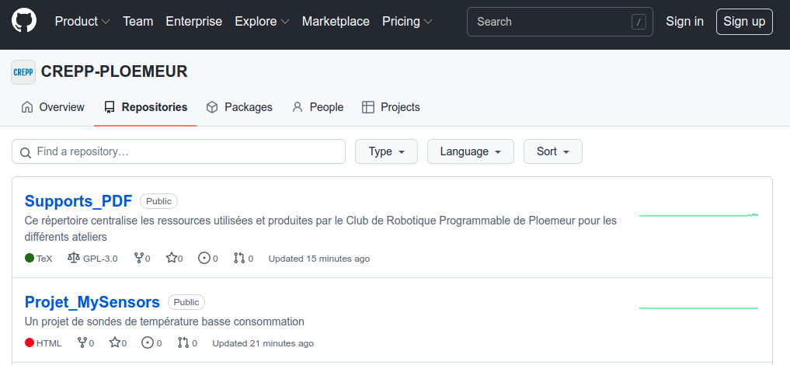
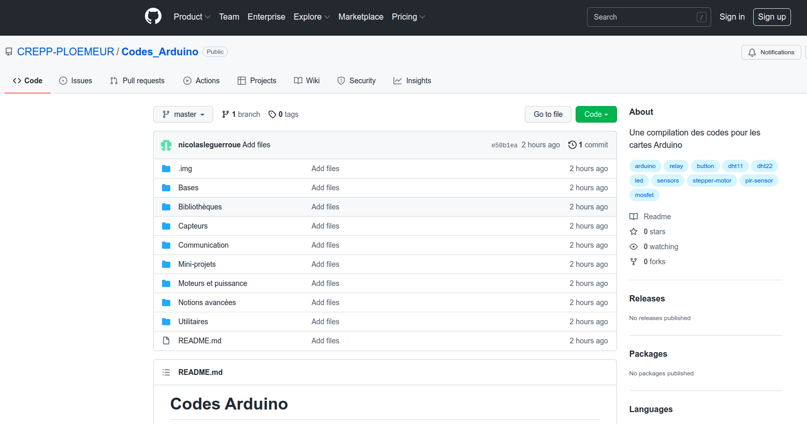
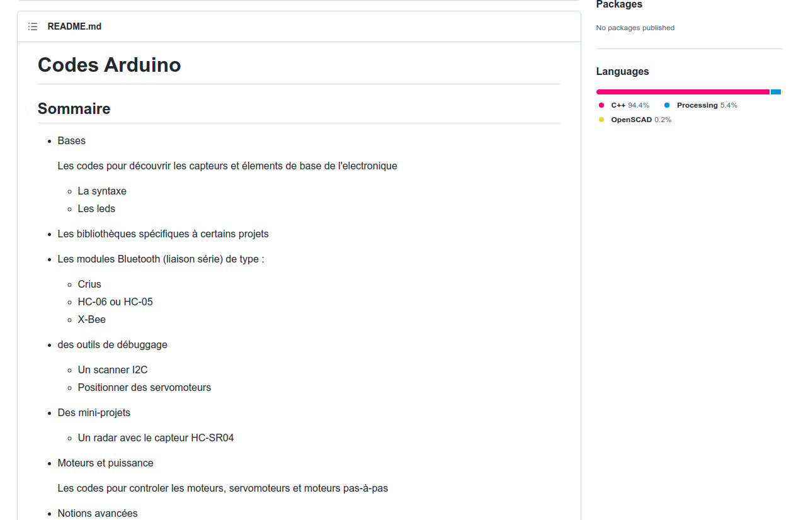
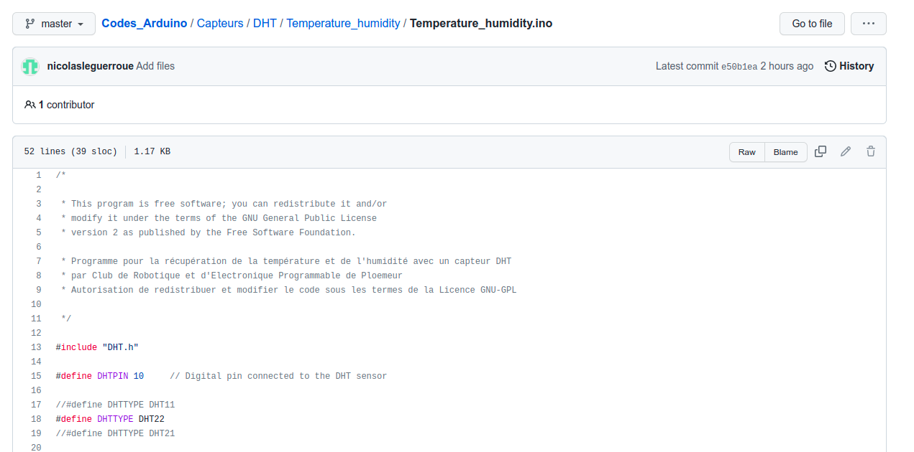
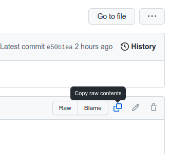
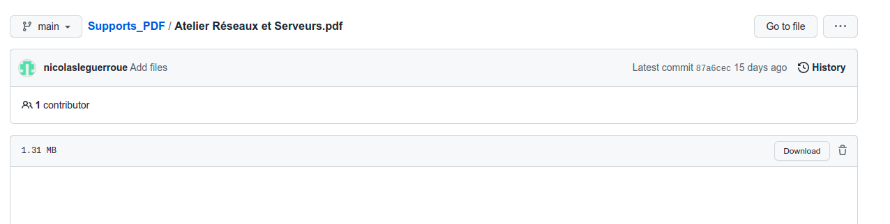
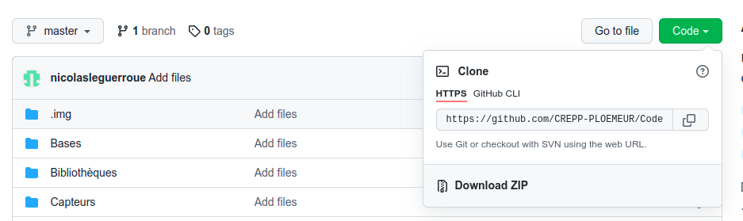

Ce document a pour objectif d'expliquer le fonctionnement de Git pour les ateliers du CREPP. 
Un répertoire Git a été créé pour centraliser les supports des ateliers ainsi que les codes et projets produits depuis la création du CREPP en 2012. 
Il est donc en perpétuelle amélioration. 
<h3>Localisation</h3>
Le répertoire est disponible à l'adresse suivante : <a class="alert-link">https://github.com/CREPP-PLOEMEUR</a> ou bien en passant sur
 le site du CREPP, dans la section <b>Ressources GIT</b>
 
<figure id=''>
<figcaption>Figure 1 - Accès aux ressources GIT</figcaption>
</figure>

<h3>Menu principal</h3>

Une fois le lien cliqué, vous tombez directement sur cette interface  

<figure id=''>
<figcaption>Figure 2 - La page principale du répertoire Git</figcaption>
</figure>

Les répertoires facilement accessibles sont : 
<ul>
    <li> Le répertoire <b>Supports PDF</b> regroupe les supports PDf utilisés pour les Ateliers Arduino et Microcontrôleurs.</li>
    <li> Le répertoire <b>Codes Arduino</b> est une compilation des codes Arduino utilisés lors des ateliers.</li>
    <li> Le répertoire <b>Codes ESP12</b> est une compilation des codes ESP12 des ateliers.</li>
</ul>
Sous ces trois répertoires, vous avez accès à l'ensemble des répertoires du CREPP. Pour afficher tous les répertoires, vous pouvez cliquer  
sur <b>View all repositories</b> en bas de la page.

<figure id=''>
<figcaption>Figure 3 - Afficher l'ensemble des répertoires</figcaption>
</figure>
Il est possible de classer les répertoires en cliquant sur <b>Sort</b> et de les classer en fonction de :
<ul>
    <li> Les dates de modifications </li>
    <li> Les noms </li>
</ul>
<figure id=''>
<figcaption>Figure 4 - Trier les répertoires</figcaption>
</figure>
Actuellement, voici les répertoires :  
<ul>
<li> codes Arduino </li>
<li> Codes ESP12 </li>
<li> Codes Pico </li>
<li> Projets Ateliers\_Jeunes </li>
<li> Projet Capteur pollution\_atmospherique </li>
<li> Projet Cocci-Bot </li>
<li> Projet Crepp-Rap </li>
<li> Projet Fauteuil roulant </li>
<li> Projet MySensors </li>
<li> Projet Pot Qui pense </li>
<li> Projet Raspi-Bot </li>
<li> Projet SimpleCDBot </li>
<li> Projet Ventilateur </li>
<li> Supports PDF  </li>
</ul>
<h3>Exploration d'un répertoire</h3>
<h4>L'arborescence</h4>
En cliquant sur un répertoire, l'arborescence de ce dernier apparaît avec le premier rang des dossiers et les fichiers sur le même niveau. 
En cliquant sur les noms des dossiers, on peut parcourir l'arborescence du répertoire complet. 
<figure id=''>
<figcaption>Figure 5 - L'arborescence du répertoire</figcaption>
</figure>

Une description du répertoire est disponible avec un fichier README.md. (ici le répertoire Codes Arduino) 

<figure id=''>
<figcaption>Figure 6 - Une description du répertoire</figcaption>
</figure>
Les principaux langages utilisés dans le répertoires sont indiqués à droite de la section <b>README</b>.
<h4>Récupération d'un fichier</h4>
<h4>Un fichier contenant du code</h4>
Pour récupérer le contenu  d'un fichier particulier, il faut parcourir l'arborescence pour le trouver. 
Une fois le fichier localisé, il faut cliquer sur le fichier afin de voir son contenu :  
<figure id=''>
<figcaption>Figure 7 - Un contenu de fichier</figcaption>
</figure>
Enfin, il ne reste plus qu'à cliquer sur <b>Copy raw contents</b>
pour copier tout le texte du fichier dans le presse-papier. 
<figure id=''>
<figcaption>Figure 8 - Copier le contenu d'un fichier</figcaption>
</figure>
<h4>Un fichier PDF</h4>
Pour récupérer le fichier PDF, après l'avoir localisé, il suffit de cliquer sur le bouton <b>Download</b>.
<figure id=''>
<figcaption>Figure 9 - Téléchargement d'un fichier PDF</figcaption>
</figure>

<h4>Remarque</h4>Cette méthode est contraignante quand nous sommes ammenés à manipuler plusieurs fichiers au sein d'un même répertoire. La méthode suivante va vous expliquer comment télécharger directement tout un répertoire pour travailler par la suite en local.

<h3>Téléchargement d'un répertoire</h3>
Pour télécharger un répertoire dans son intégralité, il faut tout d'abord se placer à la racine de celui-ci en cliquant sur le  
nom du répertoire (Codes\_Arduino): 
<figure id=''>
<figcaption>Figure 10 - Déplacement à la racine du répertoire</figcaption>
</figure>
Ensuite, il faut cliquer sur le bouton vert Code pour dérouler un petit menu puis cliquer sur <b>Download ZIP</b>
<figure id=''>
<figcaption>Figure 11 - Téléchargement du répertoire</figcaption>
</figure>
Le répertoire va se télécharger au format ZIP dans vos téléchargements avec le suffixe <b>-master</b>. 
Par exemple, le répertoire <b>Codes Arduino</b> sera téléchargé sous le nom <b>Codes Arduino-master.zip</b>.
Il ne vous reste plus qu'à extraire le fichier pour explorer le répertoire. 

</body></html>
